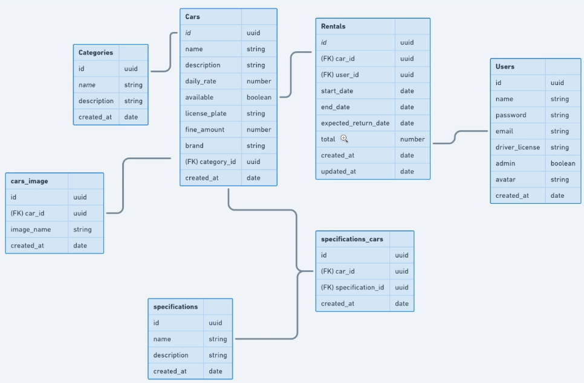

# Projeto Rentalx

## Configurações Prettier e Eslint

- [Configs](https://www.notion.so/ESLint-e-Prettier-Trilha-Node-js-d3f3ef576e7f45dfbbde5c25fa662779#eaf6e8bdcabc4d809cdae302e29750da)

## Dependências

- yarn init -y
- yarn add eslint -D
- yarn eslint --init
- yarn add @typescript-eslint/eslint-plugin@latest eslint-config-airbnb-base@latest eslint-plugin-import@^2.22.1 @typescript-eslint/parser@latest -D
- yarn add -D eslint-plugin-import-helpers eslint-import-resolver-typescript
- yarn add prettier eslint-config-prettier eslint-plugin-prettier -D
- fará a converção do ts para js automático
  - yarn add ts-node-dev -D
- yarn add typescript -D
- yarn tsc --init
- desabilitar
  - "strict": true,
- yarn add uuid
- yarn add @types/uuid -D
- yarn add multer
- yarn add @types/multer
- yarn add csv-parse
- yarn add swagger-ui-express
- yarn add @types/swagger-ui-express -D
- yarn add typeorm reflect-metadata
- yarn add pg
- yarn add tsyringe
- yarn add bcrypt
- yarn add @types/bcrypt -D
- remover o bcrypt
- yarn remove bcrypt @types/bcrypt
- yarn add bcryptjs
- yarn add @types/bcryptjs -D
- yarn add jsonwebtoken
- yarn add @types/jsonwebtoken -D
- yarn add express-async-errors
- yarn add jest @types/jest -D
- yarn add ts-jest -D
- yarn add tsconfig-paths -D

- **Ao instalar o tsconfig/paths, será necessário adicionar ao package.json a seguinte descrição**
  - _-r tsconfig-paths/register_
  - **Para que ele reconheça na hora de executa a importação por modulos**

### Arquivos de ajuda

- **Pega o hash para colocar na função do JWT**
- [Criptografia MD](https://www.md5online.org/md5-encrypt.html)
- **Verifica se o JWT é valido**
- [JWT.io](https://jwt.io/)

### Configurando debug

- Clique no botão Play que tem um inserto
- Em Baixo de Run adn Debug
  - create a launc.json file
  - opção de NodeJS
- **launch** : Executa o debug assim que roda a aplicação

```
{
  "version": "0.2.0",
  "configurations": [
    {
      "type": "node",
      "request": "attach",
      "name": "Launch Program",
      "skipFiles": ["<node_internals>/**"],
      "outFiles": ["${workspaceFolder}/**/*.js"]
    }
  ]
}
```

#### Adicionar --inspect aos scripts de dev



## SOLID

##### S

- **SRP** Single Responsability Principle (Princípio da Responsabilidade Única)

##### O

- **OCP** Open Closed Principle (Princípio do Aberto/Fechado)

##### L

- **LSP** Liskov Substituion Priciple (Princípio da Substituição de Liskov)
- Bárbara liskov
- Se você tem uma classe "S", e essa classe é um subtipo de "T", então todos os objetos do tipo "T", podem ser subtituidos pelo tipo "S" sem que seja necessário alterar as propriedades desse programa.

##### I

- **ISP** Interface Segregation Principle (Princípio da Segregação de Interface)

##### D

- **DIP** Dependency Inversion Principle (Princípio da Inversão de Dependência)

## Instalação do Docker

- O Docker é uma ferramenta sensacional que nos permite pular as etapas chatas de configuração de serviços para nossa aplicação. Além disso, ele permite reaproveitarmos o Kernel da máquina hospedeira entre vários serviços executados simultaneamente, conhecidos como containers.

- Para iniciar a instalação do Docker vamos prosseguir para a seção "Get Started" presente no site da ferramenta:

- [Get Started with Docker | Docker](https://www.docker.com/get-started)

---

## TSYRINGE

- container faz o registro da instância
- singleton
- Interface para o repositório
- nome para o registro
- repositório
- Inject passando como parametro o nome do registro
- Injectable: permite a injecção da classe, por exemplo pelo controle
- container.resolve no controller: para injectar a dependência
- importar o shared/container no server.ts

### Windows (64 Bit)

- O Docker no Windows possui alguns requisitos:

- Microsoft Windows 10 Professional ou Enterprise 64-bit
- Caso você possua o Windows 10 Home 64-bit também é possível usar o Docker mas será necessário instalar o WSL2 também (o instalador já se encarrega disso para você)

- Caso você possua o Windows 32-bit, não será possível realizar a instalação do Docker.

- Caso tenha todos requisitos, então faça a instalação do Docker para Windows:

- [Docker Desktop for Mac and Windows | Docker](https://www.docker.com/products/docker-desktop)

- Depois de instalar o Docker e abrir o software você já está pronto para continuar. Lembrando que essa versão do Docker para Windows tem uma interface visual muito bacana, ou seja, você pode usar a interface para visualizar os serviços sendo executados, logs, imagens e muito mais.

- Para verificar que o Docker foi instalado corretamente, em **uma nova janela** do terminal execute:

```bash
docker version
```

---

### Mac OSX

- No macOS o processo de instalação do Docker é extremamente simples, você precisa apenas baixar o app executável e executa-lo na máquina para iniciar o Docker:

- [Docker Desktop for Mac - Docker Hub](https://hub.docker.com/editions/community/docker-ce-desktop-mac)

- Depois de aberto você pode garantir que o Docker foi instalado corretamente executando o comando abaixo em uma nova janela do terminal:

```bash
docker version
```

---

### Linux (Ubuntu/Debian)

- No Linux, vamos instalar o Docker utilizando o `apt`, para isso, em seu terminal, execute os comandos abaixo:

```bash
sudo apt update
sudo apt remove docker docker-engine docker.io
sudo apt install docker.io
```

- Agora com o Docker instalado, vamos habilitar para que seu serviço seja iniciado automaticamente com o sistema:

```bash
sudo systemctl start docker
sudo systemctl enable docker
```

- Para garantir que o Docker foi instalado da forma correta, execute no terminal:

```bash
docker version
```

- Você precisará executar todos comandos do Docker utilizando o `sudo`, mas caso queira executa-los sem o `sudo`, utilize [esse guia](https://docs.docker.com/engine/install/linux-postinstall/#manage-docker-as-a-non-root-user).

## Instalação do Docker Compose

- Como visto durante as aulas, o Docker Compose precisará ser instalado apenas no Linux, já que nos demais sistemas ele já vem instalado junto com o Docker.

### Linux (Ubuntu/Debian)

- Rode o seguinte comando para instalar o Docker Compose:

```bash
sudo curl -L "https://github.com/docker/compose/releases/download/1.28.5/docker-compose-$(uname -s)-$(uname -m)" -o /usr/local/bin/docker-compose
```

- Aplique as permissões necessárias ao binário:

```bash
sudo chmod +x /usr/local/bin/docker-compose
```

- Após isso, rode o comando `docker-compose --version` para assegurar que a instalação foi um sucesso. Caso retorne algum erro (mesmo reiniciando o terminal), crie um link simbólico para `usr/bin` com o seguinte comando:

```bash
sudo ln -s /usr/local/bin/docker-compose /usr/bin/docker-compose
```

- Por fim, teste novamente com o comando `docker-compose --version` para checar se está tudo funcionando.

### Comandos utilizados durante aplicação

- docker -v
- docker build -t rentx .
- docker run -p 3333:3333 rentx
- docker exec -it nome_container /bin/bash
- docker exec -it nome_container bash
- docker stop nome_container

### Dockerfile da aplicação

```
FROM node

WORKDIR /usr/app

COPY package.json ./

RUN npm install

COPY . .

EXPOSE 3333

CMD ["npm","run","dev"]
```

### docker-compose da aplicação

- docker-compose up
- **mostra logs do container em execução**
- docker logs nome-container -f
- docker-compose up --force-recreate
- docker inspect --format='{{range.NetworkSettings.Networks}}{{.IPAddress}}{{end}}' rentx
- docker inspect --format='{{range.NetworkSettings.Networks}}{{.IPAddress}}{{end}}' database_ignite
- docker container exec -it rentx /bin/sh
- Caso aconteça algum erro de conexão entre os container
  - docker-compose down -v --rmi local
  - docker-compose up -d
- Caso teste
  - index do database

```
export default async (host = "database"): Promise<Connection> => {
  const defaultOptions = await getConnectionOptions();
  return createConnection(
    Object.assign(defaultOptions, {
      host,
    })
  );
};
```

- No servidor

```
import createConnection from "@shared/infra/typeorm";
createConnection("localhost");
```

```
version: "3.7"
services:
  app:
    build: .
    conatainer_name: rentx
    ports:
      - 3333:3333
    volumes:
      - .:/usr/app

```

- Habilitar para permitir decorators
  - "experimentalDecorators": true,
  - "emitDecoratorMetadata": true,

### Migrations

- Executando migrations
  - package.json

```
"typeorm": "ts-node-dev ./node_modules/typeorm/cli"
```

- yarn typeorm migration:run
- yarn typeorm migration:revert
- yarn typeorm migration:create -n CreateCategories
- yarn typeorm migration:create -n CreateSpecifications
- yarn typeorm migration:create -n CreateUsers
- yarn typeorm migration:create -n AlterUserAddAvatar
- yarn typeorm migration:create -n CreateCars
- yarn typeorm migration:create -n CreateSpecificationsCars
- yarn typeorm migration:create -n CreateCarImages
- yarn typeorm migration:create -n CreateRentals
- yarn typeorm migration:create -n CreateUsersToken

### Tests

- yarn jest --init
- _set NODE_ENV=test && jest --runInBand --detectOpenHandles_

### Requisitos Funcionais

- Funcionalidades que que nosso sistema vai ter.
  - Usuário vai pode cadastrar uma categoria
  - Usuário poderá recuperar a senha de E-mail

### Requisitos Não Funcionais

- Requisitos que não estão ligados diretamente a aplicação com a regra de negócio
  - Os dados devem ser salvos no banco de dados postgres
  - E mais uma conteito de qual banco utiliza ou biblioteca

### Regra de negócio

- Regras de fato por trás de nossos requisitos.
  - Não deve ser possível cadastrar uma categoria já existente.
  - Não é possível cadastrar categoria com nome menor que quatro.

## Cadastro de carros

**RF**

- Deve ser possível cadastrar um novo carro.

**RN**

- Não deve ser possível cadatrar um carro com uma placa já existente.
- O carro deve ser cadastrado, por padrão, com disponibilidade.
- _O usuário responsavél pelo cadastro deve ser um usuário administrador._

## Listagem de carros

**RF**

- Deve ser possível listar todos os carros disponíveis.
- Deve ser possível listar todos os carros disponíveis pelo nome da categoria
- Deve ser possível listar todos os carros disponíveis pelo nome do carro

**RN**

- O usuário não precisa está logado no sistema.

## Cadastro de especificações do carro

**RF**

- Deve ser possível cadastrar uma especificação para um carro.
- Deve ser possível listar todas as especificações
- Deve ser possível listar todos os carros.

**RN**

- Não deve ser possível cadastrar uma especificação para um carro não cadastrado.
- Não deve ser possível cadastrar uma especificaçao já existente para um mesmo carro.
- O usuário responsável pelo cadastro dever ser um usuário administrador

## Cadastro da imagem do carro

**RF**

- Deve ser possível cadastrar a imagem do carro
- Deve ser possível listar todos os carros

**RNF**

- Utilizar o multer para upload dos arquivos

**RN**

- O usuário deve poder cadastrar mais de uma imagem para o mesmo carro.
- o usuário responsável pelo cadastro deve ser um usuário administrador.

## Aluguel de carro

**RF**

- Deve ser possivel cadastrar um aluguel

**RNF**

**RN**

- O aluguel deve ter duração mínima de 24 horas
- Não deve ser possível cadastrar um novo aluguel caso já exista um aberto para o mesmo usuário.
- Não deve ser possível cadastrar um novo aluguel caso já exista um aberto para o mesmo carro.
- O usuário deve esta logado na aplicação
- Ao realizar um aluguel, o status do carro deverá fica indisponível.

## Devolução de carros

- Se o carro for devolvido com menos de 24 horas, deverá ser cobrada a diária completa.
- Ao realizar a devolução, o carro deverá ser liberado para outro aluguel
- Ao realizar a devolução, o usuário deverá ser liberado para outro aluguel
- Ao realizar a devolução, deverá ser calculado o total do aluguel
- Caso contrário de devolução seja superior ao horário previsto de entrega, deverá ser cobrado multa proporcional aos dias de atraso.
- Caso tenha alguma multa, deverá ser somado ao total do aluguel.
- O usuário não precisa está logado no sistema.

# Listagem de Alugueispara usuários

**RF**

- Deve ser possível realizar a busca de todos os alugueis para o usuário

**RN**

- O usuário deve estar logado na aplicação

# Recuperar senha

**RF**

- Deve ser possível o usuário recuperar a senha informando o e-mail
- O Usuário deve receber um e-mail com o passo a passo para a recuperação da senha

* O Usuário deve conseguir inserir uma nova senha

**RN**

- O Usuário precisa informar uma nova senha
- O link enviado para a recuperação deve expirar em 3 horas.

### ERROS

- ormconfig.json
  - "host": "localhost",
  - "host": "database_ignite",
- set NODE_ENV=test && jest --runInBand --detectOpenHandles

### E-mail Fake

[Ethereal](https://ethereal.email/)

### Test

- yarn test src/modules/accounts/useCases/sendForgotPasswordMail/SendForgotPasswordMailUseCase.spec.ts

## pgAdmin

### Usado como SGBD

- Acesso: http://localhost:15432
- E-mail e senha para acesso criados no docker-compose
- Server
  - Create
    - Server
      - General
        - Nome do banco
      - Connection
        - Host
        - Porta
        - Database
        - Usuário
        - Senha

## SDK AWS

- yarn add aws-sdk
  [Variaveis de ambiente que AWS identifica](https://docs.aws.amazon.com/sdk-for-javascript/v2/developer-guide/loading-node-credentials-environment.html)

## OBS

- Pega o refresh_token do serviço de **Session**
- Colocar no serviço Refresh Token, ele gera um novo token

## Na máquina AWS

- sudo apt-get update
- sudo apt-get upgrade
- sudo adduser app
- sudo usermod -aG sudo app
- mkdir .ssh
- chmod 700 .ssh
- cd .ssh
- touch authorized_keys
- chmod 600 authorized_keys
- vi authorized_keys
  - Pelo git bash em sua máquina local
  - ssh-keygen
  - Enter x3
  - vá em c/Users/seu_usuario/.ssh/id_rsa
  - ssh app@54.165.203.32
  - sudo service ssh restart
  - cole a chave gerada no _authorized_keys_
- :wq!

### Instalação do Node na máquina AWS

[Nodejs](https://github.com/nodesource/distributions/blob/master/README.md)

```
curl -fsSL https://deb.nodesource.com/setup_14.x | sudo -E bash -
sudo apt-get install -y nodejs
```

### Instalação do Docker na máquina AWS

[Docker](https://docs.docker.com/engine/install/ubuntu/)

```
sudo apt-get remove docker docker-engine docker.io containerd runc

sudo apt-get install \
    ca-certificates \
    curl \
    gnupg \
    lsb-release

curl -fsSL https://download.docker.com/linux/ubuntu/gpg | sudo gpg --dearmor -o /usr/share/keyrings/docker-archive-keyring.gpg

echo \
"deb [arch=$(dpkg --print-architecture) signed-by=/usr/share/keyrings/docker-archive-keyring.gpg] https://download.docker.com/linux/ubuntu \
$(lsb_release -cs) stable" | sudo tee /etc/apt/sources.list.d/docker.list > /dev/null

sudo apt-get update

sudo apt-get install docker-ce docker-ce-cli containerd.io

```

### Instalação do Docker-compose na máquina AWS

[Docker compose](https://docs.docker.com/compose/install/)

```
sudo curl -L "https://github.com/docker/compose/releases/download/1.29.2/docker-compose-$(uname -s)-$(uname -m)" -o /usr/local/bin/docker-compose

sudo chmod +x /usr/local/bin/docker-compose


```

### Instalação YARN

- sudo npm install --global yarn

### Libs para build

- yarn add @babel/preset-typescript @babel/cli @babel/core @babel/plugin-proposal-class-properties @babel/plugin-proposal-decorators @babel/preset-env babel-plugin-module-resolver babel-plugin-transform-typescript-metadata -D

### Keygen de EC2 para github

- gerar keygen
- ssh-keygen
- cat .ssh/id_rsa.pub
- copia tudo
- vai em no github
- settings
- SSH and GPG key
- e cola

### Criação de usuário para o docker

- sudo groupadd docker
- sudo usermod -aG docker $USER

### Subir apenas o serviço de banco no docker-compose

- docker-compose up -d database
- docker exec -it database_ignite /bin/bash

### Configurar actions do GITHUB

### SSH

- na sua máquina
- criar uma chave ssh
- ssh-keygen
  - github_actions
  - dai vai gerar duas chaves, github_actions e github_actions.pub
- copia a github_actions.pub e cola junto com a authorized_keys na aws
- cat >> authorized_keys
- dê enter
- cole github_actions.pub
- ctrl + d
- pronto foi adicionada a authorized_keys
- voltando para sua máquina dê um
- cat github_actions, e copie tudo
- será a chave **SSH_KEY** do github

#### ACTIONS

- actions
- set up workflow youself

```
# This is a basic workflow to help you get started with Actions

name: CI

# Controls when the workflow will run
on:
  # Triggers the workflow on push or pull request events but only for the main branch
  push:
    branches: [ main ]
  #pull_request:
    #branches: [ main ]

  # Allows you to run this workflow manually from the Actions tab
  workflow_dispatch:

# A workflow run is made up of one or more jobs that can run sequentially or in parallel
jobs:
  # This workflow contains a single job called "build"
  build:
    # The type of runner that the job will run on
    runs-on: ubuntu-latest

    # Steps represent a sequence of tasks that will be executed as part of the job
    steps:
      # Checks-out your repository under $GITHUB_WORKSPACE, so your job can access it
      - uses: actions/checkout@v2
      # Setup node: https://github.com/actions/setup-node
      - name: Setup Nodejs
        uses: actions/setup-node@v2
        with:
          node-version: 14.x

      - name: Install Dependecies
        run: |
             cd Rentalx/
             yarn

      - name: Build
        run: |
             cd Rentalx/
             yarn run build
      # Copia arquivos via SSH:  https://github.com/marketplace/actions/scp-files
      - uses: appleboy/scp-action@master
        with:
          host: ${{ secrets.SSH_HOST }}
          username: ${{ secrets.SSH_USER }}
          port: ${{ secrets.SSH_PORT }}
          key: ${{ secrets.SSH_KEY}}
          source: "., !node_modules"
          target: "~/app/Ignite"
```

- nível gratuito **2000 builds minuto no mês**

#### SETTINGS

- **Credenciais**
- Settings
- Secret Actions
- chaves a serem criadas

```
SSH_HOST  = ip da aws
SSH_KEY   = github_actions
SSH_PORT  = 22
SSH_USER  = app
```

### Refereences

[Setup node](https://github.com/actions?q=&type=all&language=&sort=)
[SCP files](https://github.com/marketplace/actions/scp-files)

## Proxy reverso com NGINX

- sudo apt install nginx
- em security group na aws
- habilitar as portas 80-http e 443-https
- cd /etc/nginx/sites-available/
- cat default
- sudo touch rentx

```
server {
        listen 80 default_server;
        listen [::]:80 default_server;

        location / {
          proxy_pass http://localhost:3333;
          proxy_http_version 1.1;
          proxy_set_header Upgrade $http_upgrade;
          proxy_set_header Connection 'upgrade';
          proxy_set_header Host $host;
          proxy_cache_bypass $http_upgrade;
    }
}
```

[how to set up a node.js application for production on ubuntu 18.04](https://www.digitalocean.com/community/tutorials/how-to-set-up-a-node-js-application-for-production-on-ubuntu-18-04-pt)

- _mude a porta_
- criar link simbolico
- sudo ln -s /etc/nginx/sites-available/rentx rentx
- sudo rm -rf default
- sudo service nginx restart
- sudo systemctl restart nginx
- **OBS: Deu problema, então renomeie rentx para default**
- node dist/shared/infra/http/server.js

## PM2

- gerenciador de processos do node
- https://pm2.keymetrics.io/
- sudo npm install pm2 -g
- pm2 start dist/shared/infra/http/server.js --name rentx_api
- pm2 start rentx_api
- pm2 stop rentx_api
- ./node_modules/.bin/typeorm migration:run

## Acessar Postgres pelo docker

- docker exec -it database_ignite /bin/bash
- postgres -h localhost -U docker -w
- psql --host=localhost --port=5432 -W --dbname=ignite

## Node modules atualizada, rodar migrations

[scp](https://github.com/appleboy/ssh-action)

```
- name: Update API
        uses: appleboy/ssh-action@master
        with:
          host: ${{ secrets.SSH_HOST }}
          username: ${{ secrets.SSH_USER }}
          port: ${{ secrets.SSH_PORT }}
          key: ${{ secrets.SSH_KEY}}
          script: |
            cd ~/app/Ignite/Rentalx
            yarn
            ./node_modules/.bin/typeorm migration:run
            pm2 restart rentx_api
```

## Configurando domínio e SSL

- No console da AWS
- Router 53

  - Criar zona hospedada
  - Domínio que você comprou
  - Zona hospedada públic
  - Criar
  - Acessa a zona criada
  - Criar registro
    - Coloca um subdomínio
    - Ip Instância
    - Criar registro

- Vá no Google domains
- DNS
- Registros de recursos personalizados
  - Coloca o subdomínio criado na aws
  - Letra que tiver no Alias da AWS
  - IP da instância
  - Adicionar
- Verificar se está tudo ok
- vai em :
  [Whats My DNS](https://www.whatsmydns.net/)
- coloca o DNS com subdomínio

## Certificado WEB

- Tem que ter domínio pra isso
  [Validar Certificado](https://certbot.eff.org/)

- Seleciona o servidor
- Seleciona o S.O
  - Conecta via SSh
  - Instala o snapd **não obrigatório**
  - sudo snap install core; sudo snap refresh core
  - sudo snap install --classic certbot
  - sudo ln -s /snap/bin/certbot /usr/bin/certbot
  - sudo certbot --nginx
  - **colocar o do subdomínio**
  - sudo certbot certonly --nginx
  - sudo certbot renew --dry-run
  - Verificar se as configurações foram incluidas no /etc/nginx/sites-available
  - vim default
  - sudo service nginx restart
  - fazer uma requisição para
  - https://subdominio.dominio.com **o seu**

## CORS

- npm i cors
- npm i @types/cors -D

[Google Domain](https://domains.google/intl/pt-BR/?gclid=CjwKCAjw8sCRBhA6EiwA6_IF4VAapXMjTPo7bHUUMDqKhCv2rWBu9tfnPQ568cqGsiBzEcrJf9KXOhoCeeEQAvD_BwE&gclsrc=aw.ds)
